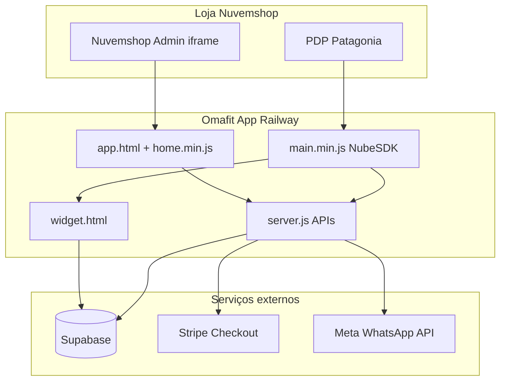

# Homologação Nuvemshop — Omafit (App 23607)

Checklist operacional para enviar o app à homologação e publicação na App Store Nuvemshop.

**Produção:** `https://omafit-nuvem-production.up.railway.app`  
**Loja demo atual:** `6994912` — `arrascaneta.lojavirtualnuvem.com.br`

---

## 1. Partner Portal (obrigatório)

No [Partner Portal](https://partners.nuvemshop.com.br), app **23607**:

| Campo | Valor |
|-------|-------|
| **App URL** | `https://omafit-nuvem-production.up.railway.app/app.html` |
| **Redirect URL** | `https://omafit-nuvem-production.up.railway.app/auth/callback` |
| **Preferences URL** | `https://omafit-nuvem-production.up.railway.app/app.html?section=widget` |
| **Support URL** | `https://omafit-nuvem-production.up.railway.app/app.html?section=dashboard` |
| **Store redact webhook** | `https://omafit-nuvem-production.up.railway.app/api/webhooks/nuvemshop` |
| **Customer redact webhook** | `https://omafit-nuvem-production.up.railway.app/api/webhooks/nuvemshop` |
| **Customer data request** | `https://omafit-nuvem-production.up.railway.app/api/webhooks/nuvemshop` |
| **Script storefront (NubeSDK)** | `https://omafit-nuvem-production.up.railway.app/main.min.js` |
| **Uses NubeSDK** | Ativado |
| **Billing no Portal** | Grátis + **Possui vendas no aplicativo** |

### Permissões OAuth

- `read_products`, `read_content`, `read_orders`, `write_scripts` (já ativas na loja teste).

Após alterar permissões: **desinstalar e reinstalar** o app na loja demo, depois **Sincronizar loja** no admin Omafit.

---

## 2. Loja demo para homologação

A revisão Nuvemshop exige vitrine com tema **Patagonia** + NubeSDK (`main.min.js`).

### Passos na loja demo

1. **Nuvemshop Admin** → Design → trocar tema para **Patagonia**.
2. **Remover** do tema o script legado `storefront-legacy.min.js` (se existir no HTML personalizado).
3. Garantir que o app injeta apenas `main.min.js` (Partner Portal + Uses NubeSDK).
4. Ter **pelo menos 1 produto de vestuário** e **1 de calçado** (ex.: tênis na coleção `tenis`) com fotos e variantes de tamanho.
5. No admin Omafit:
   - **Sincronizar loja**
   - Configurar **Widget** (CTA ativo, texto “Assistente inteligente”)
   - Criar **tabela de medidas** vinculada à coleção

### Teste na PDP (Patagonia)

- [ ] Botão Omafit **acima** do comprar (sem duplicata)
- [ ] Modal abre com widget (`widget.html` ou `widget-footwear.html`)
- [ ] Try-on / calculadora de tamanho funciona
- [ ] Adicionar ao carrinho via NubeSDK (`cart:add`)

### Morelia e outros temas (pós-publicação)

Lojas em temas sem NubeSDK usam `storefront-legacy.min.js` — **não** enviar isso na homologação; é só compatibilidade em produção.

---

## 3. Variáveis Railway (produção)

| Variável | Valor esperado |
|----------|----------------|
| `NUVEMSHOP_APP_URL` | `https://omafit-nuvem-production.up.railway.app` |
| `OMAFIT_BILLING_MODE` | `self` |
| `OMAFIT_SUPPORT_URL` | `https://omafit-nuvem-production.up.railway.app/app.html?section=dashboard` |
| `OMAFIT_WIDGET_URL` | `https://omafit-nuvem-production.up.railway.app/widget.html` |
| `STRIPE_SECRET_KEY` | `sk_live_...` |
| `STRIPE_PRICE_*` | Price IDs **live** (não teste) |
| `STRIPE_WEBHOOK_SECRET` | Signing secret do webhook **live** |
| `OMAFIT_WHATSAPP_PROXY_SECRET` | Igual ao secret no Supabase Edge Functions |
| `OMAFIT_STOREFRONT_SDK_STORE_IDS` | `6994912` (whitelist homolog se tema ainda não for Patagonia) |

Validação rápida:

```
GET https://omafit-nuvem-production.up.railway.app/api/health
GET https://omafit-nuvem-production.up.railway.app/api/billing/debug?store_id=6994912&store_url=arrascaneta.lojavirtualnuvem.com.br
```

Esperado: `hasStoreRecord: true`, `selfBillingReady: true`, `webhooksReady: true`.

---

## 4. Stripe (live)

1. Dashboard Stripe → modo **Live** → Webhooks.
2. Endpoint: `https://omafit-nuvem-production.up.railway.app/api/webhooks/stripe`
3. Eventos: `checkout.session.completed`, `customer.subscription.*`, `invoice.*` (conforme `lib/stripe-billing.js`).
4. Copiar **Signing secret** para `STRIPE_WEBHOOK_SECRET` no Railway.

---

## 5. Diagrama de arquitetura (anexar na submissão)



---

## 6. Roteiro de vídeo (2–4 min)

1. Instalar app na loja demo (OAuth).
2. Abrir admin Omafit → Dashboard → **Sincronizar loja**.
3. Aba **Widget**: ativar, escolher posição e texto do CTA.
4. Aba **Tabelas**: mostrar tabela de medidas.
5. Aba **Plano**: assinar Growth (redirect Stripe) ou On-Demand.
6. Abrir PDP no tema Patagonia → clicar **Assistente inteligente**.
7. Usar provador / tamanho recomendado → adicionar ao carrinho.
8. (Opcional) Analytics e Try On Marketing.

---

## 7. FAQs (copiar para o Partner Portal)

**O que o Omafit faz?**  
Provador virtual e recomendação de tamanho na página do produto, reduzindo devoluções e aumentando conversão.

**Preciso de conhecimento técnico?**  
Não. Instale o app, configure widget e tabelas de medidas no painel Omafit.

**Como é a cobrança?**  
Modelo freemium: plano On-Demand gratuito com sessões incluídas; planos pagos (Growth, Pro) via Stripe no painel do app.

**Quais temas são suportados na vitrine?**  
Homologação e NubeSDK: tema **Patagonia**. Outros temas usam script legado compatível após publicação.

**O app acessa dados sensíveis?**  
Apenas dados necessários: produtos, pedidos (para billing de uso) e configurações da loja via OAuth. Imagens do try-on são processadas para recomendação de tamanho.

**Como cancelar?**  
Desinstale o app na Nuvemshop ou cancele a assinatura no portal Stripe (aba Plano).

**Suporte**  
`contato@omafit.co` — painel em `app.html?section=dashboard`.

---

## 8. Política de privacidade (resumo)

Publicar em `https://omafit.co/privacidade` (ou URL indicada no Portal):

- Dados coletados: store_id, domínio, produtos, configurações do widget, métricas de uso de try-on, dados de billing.
- Finalidade: operar provador virtual, billing e suporte.
- Compartilhamento: Supabase (infra), Stripe (pagamentos), Meta (WhatsApp Marketing opcional).
- Retenção: conforme contrato e obrigações legais; webhooks LGPD (`store/redact`, `customers/redact`) implementados.
- Contato: `contato@omafit.co`.

---

## 9. O que enviar na homologação

- [ ] Link da loja demo (Patagonia, app instalado)
- [ ] Vídeo do fluxo completo
- [ ] Screenshots: admin (Dashboard, Widget, Plano) + PDP com botão Omafit
- [ ] Diagrama de arquitetura (seção 5)
- [ ] FAQs (seção 7)
- [ ] URL de política de privacidade
- [ ] Credenciais de teste (se solicitado): login loja demo + nota de que billing usa Stripe test/live conforme ambiente

---

## 10. Status técnico (última verificação)

| Item | Status |
|------|--------|
| OAuth + webhooks | OK |
| Admin Omafit | OK |
| Billing self + Stripe live | OK |
| `nuvemshop_stores` sincronizado | OK (após Sincronizar loja) |
| Tema Patagonia na loja demo | **Ação manual** |
| Artefatos Portal (vídeo, FAQs, privacidade) | **Preencher no Portal** |
